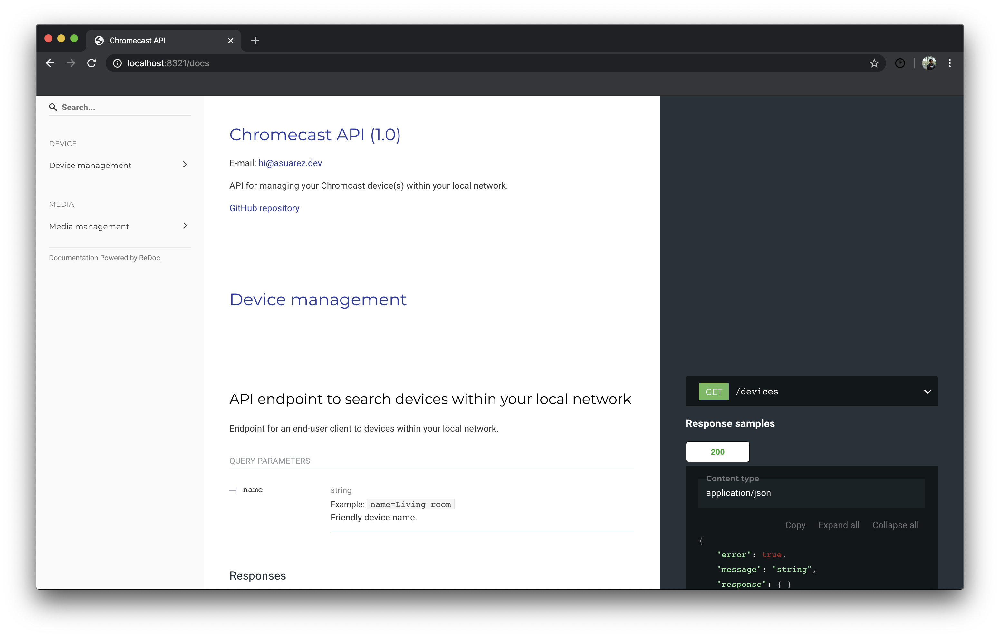

# Chromecast API

[](http://hits.dwyl.io/AlbertSuarez/chromecast-api)

[](https://GitHub.com/AlbertSuarez/chromecast-api/stargazers/)
[](https://GitHub.com/AlbertSuarez/chromecast-api/network/)
[](https://GitHub.com/AlbertSuarez/chromecast-api/graphs/contributors/)
[](https://github.com/AlbertSuarez/chromecast-api/blob/master/LICENSE)
[](https://GitHub.com/AlbertSuarez/chromecast-api)

📺 Chromecast API within your local network

[API Endpoint](http://localhost:8321/) | [API Documentation](http://localhost:8321/docs) | [Swagger UI](http://localhost:8321/ui)

<br>
<p align="center">
  
</p>
<br>

## Motivation

The idea of this project was to play a bit with the awesome [PyChromecast](https://github.com/balloob/pychromecast) Python library and move its functionalities to a the black box concept of an API.

Currently the implemented API, at port `8321`, is able to list all the available devices within the local network and cast a source given the device name and a URL with some media. Optionally, you can set `source_url=random` for being surprised with one of the gallery videos.

```
http://localhost:8321/play?source=CHROMECAST_NAME&source_url=random
```

Apart from its functionality, an API documentation (using [ReDoc](https://github.com/Redocly/redoc)) and the typical Swagger UI are available at the following URLs.

- API documentation: http://localhost:8321/docs
- Swagger UI: http://localhost:8321/ui

<br>
<p align="center">
  
  
</p>
<br>

## Requirements

1. Python 3.7+

## Recommendations

Usage of [virtualenv](https://realpython.com/blog/python/python-virtual-environments-a-primer/) is recommended for package library / runtime isolation.

## Usage

To run the API, please execute the following commands from the root directory:

1. Setup virtual environment

2. Install dependencies

    ```bash
    pip3 install -r requirements.lock
    ```

3. Run the server as a uWSGI server with the given bash script

    ```bash
    ./run.sh
    ```

    or as a Python module

    ```bash
    python3 -m src
    ```

## Authors

- [Albert Suàrez](https://github.com/AlbertSuarez)

## License

MIT © Chromecast API
